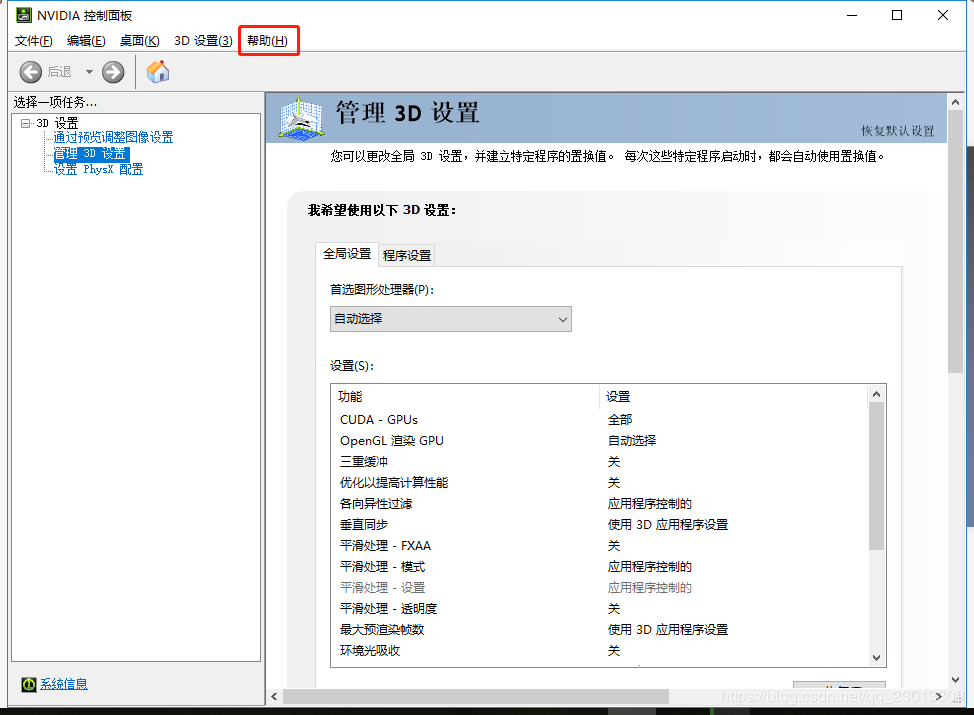
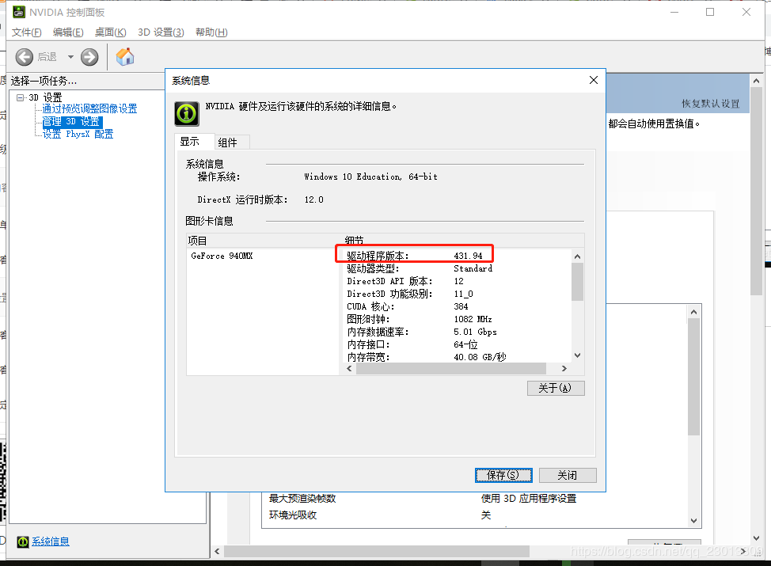
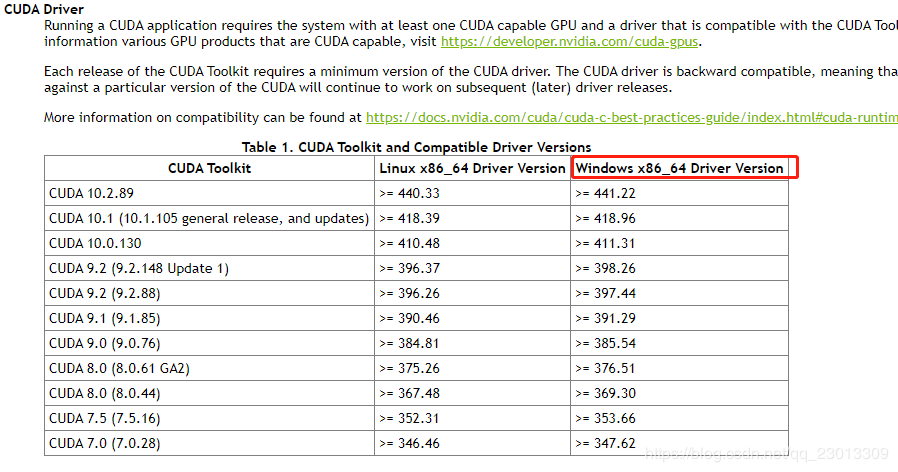

官方提供的下载指令：

` pip install torch==1.6.0+cu101 torchvision==0.7.0+cu101 -f https://download.pytorch.org/whl/torch_stable.html`

下载网址：

[https://download.pytorch.org/whl/cu101/torch-1.6.0%2Bcu101-cp36-cp36m-win_amd64.whl]()

## 关于pytorch的安装

其实在pytorch的官网  [https://pytorch.org/]( https://pytorch.org/ ) 上提供了pytorch的打包安装方法，但是在国内下载的话速度奇慢无比，而且会莫名奇妙的终止。

最好的办法就是从[清华源]( https://mirror.tuna.tsinghua.edu.cn/ )进行下载，亲测速度是相当快的。

运行以下命令即可：

```
conda config --add channels https://mirrors.tuna.tsinghua.edu.cn/anaconda/pkgs/free/
conda config --add channels https://mirrors.tuna.tsinghua.edu.cn/anaconda/pkgs/main/
conda config --set show_channel_urls yes
# reference
# https://mirror.tuna.tsinghua.edu.cn/help/anaconda/
```

```
conda config --add channels \
https://mirrors.tuna.tsinghua.edu.cn/anaconda/cloud/pytorch/
```

最后，运行如下命令即可：

```
conda install pytorch torchvision cudatoolkit=10.0
```

## 根据显卡选择合适的Cuda

在NVIDA的控制面板上，帮助中查看系统信息：



看到计算机使用的驱动版本：



按照下表选择合适的Cuda版本：



